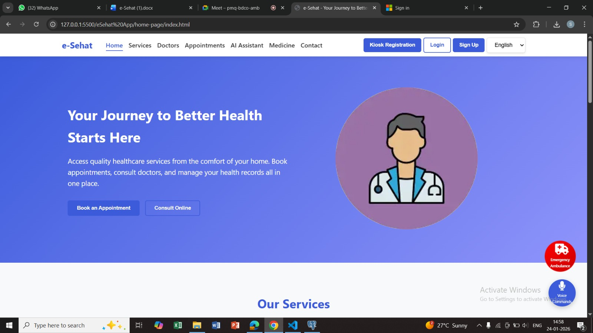
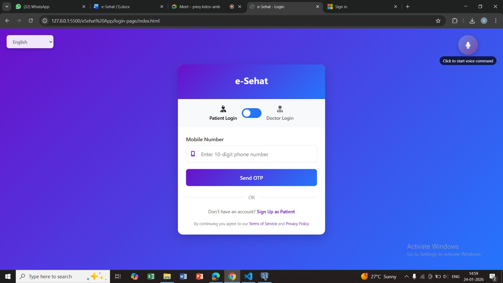
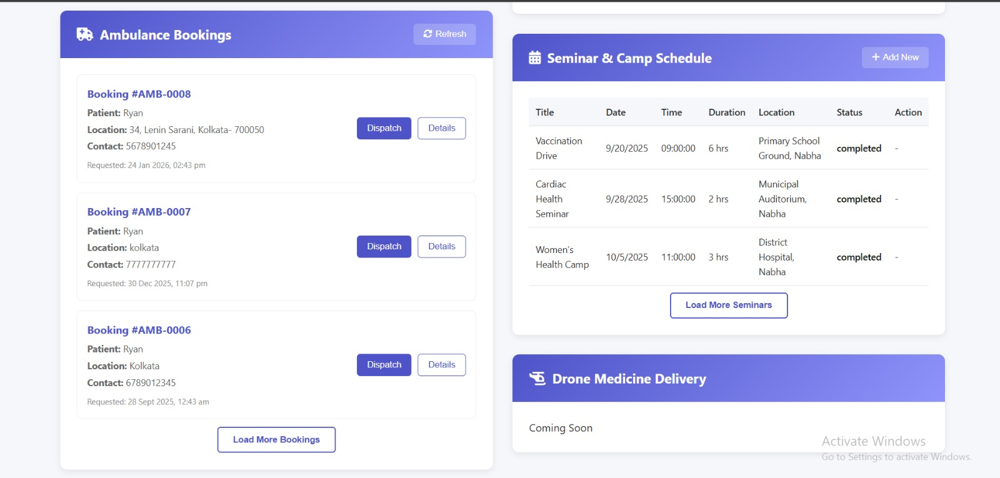

# 🏥 E-Sehat
### Smart Telemedicine Ecosystem for Rural Healthcare

E-Sehat is a comprehensive **telemedicine platform designed to improve healthcare accessibility in rural regions** by digitally connecting patients, doctors, and pharmacies on a unified platform. The system provides **AI-assisted symptom checking, online consultations, and efficient medicine delivery services**.

The project integrates **mobile applications, web platforms, and intelligent backend systems** to create a scalable digital healthcare ecosystem.

---

# 📌 Overview

Access to quality healthcare remains a challenge in rural and remote areas due to:

- Limited number of doctors
- Long travel distances to hospitals
- Delayed access to medicines
- Poor digital infrastructure

**E-Sehat** addresses these challenges by offering a **technology-driven healthcare ecosystem** that connects patients, healthcare professionals, and pharmacies through digital platforms.

---

# 🚀 Key Features

- 🩺 **Online doctor consultations**
- 🤖 **AI-guided symptom checker**
- 📱 **Mobile application for patients**
- 💻 **Web portal for doctors and administrators**
- 💊 **Medicine ordering and delivery management**
- 📊 **Digital medical record management**
- 🔐 **Secure and scalable backend infrastructure**
- 🎤 **Voice interaction using cloud APIs**

---

# 🏗 System Architecture

The E-Sehat ecosystem consists of **three main components**:

### 1️⃣ Patient Mobile Application
- Built using **React Native**
- Allows patients to:
  - Check symptoms using AI
  - Book doctor appointments
  - Access medical records
  - Order medicines

### 2️⃣ Doctor & Admin Web Platform
- Built using **HTML, CSS, and JavaScript**
- Provides tools for:
  - Appointment management
  - Patient record management
  - Prescription management
  - Pharmacy coordination

### 3️⃣ Backend Server
- Built using **Node.js with Express (TypeScript)**
- Handles:
  - API requests
  - Database management
  - Authentication
  - AI integrations
 
.png.jpeg)


---

# 🛠 Tech Stack

## Frontend

- React Native
- HTML
- CSS
- JavaScript

## Backend

- Node.js
- Express.js (TypeScript)

## Database

- PostgreSQL

## APIs & Integrations

- OpenAI API (AI health assistant)
- Google Cloud APIs (Voice interaction)

---

# ⚙️ Installation

### 1️⃣ Clone the repository

```bash
git clone https://github.com/yourusername/E-Sehat.git
```
2️⃣ Navigate to project folder
cd E-Sehat
3️⃣ Install dependencies
npm install
▶️ Running the Project

Start the backend server:
```
npm run dev
```
or
```
npm start
```
The application will start on the configured port.

📂 Project Structure
```
E-Sehat
│
├── backend
│   ├── src
│   ├── prisma
│   └── package.json
│
├── mobile-app
│   └── React Native App
│
├── web-app
│   └── HTML / CSS / JavaScript
│
└── README.md
```
## 🎯 Objectives

- Improve healthcare accessibility in rural areas  
- Provide remote consultation services  
- Enable AI-based health assistance  
- Digitize patient medical records  
- Simplify medicine delivery management  

---

## 🌍 Applications

- Rural healthcare systems  
- Telemedicine platforms  
- Digital health ecosystems  
- Remote medical consultation services






---

## 🚀 Future Improvements

- AI-powered medical diagnosis assistance  
- Integration with wearable health devices  
- Smart prescription management  
- Mobile doctor dashboard  
- Advanced health analytics  

